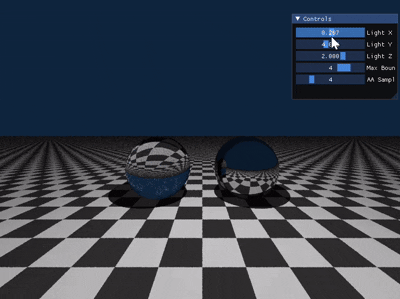
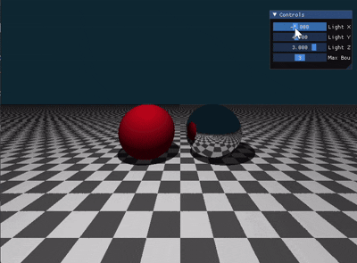

# Taichi Ray Tracer: 高性能迭代式光线追踪器

本项目是一个基于 [Taichi](https://github.com/taichi-dev/taichi) 并行计算框架实现的 Whitted-Style 光线追踪器。它通过隐式几何定义、迭代式光线弹射及物理精确的材质模型，在 GPU 上实现了实时的三维场景渲染。

---

## 🚀 项目概览

本项目旨在探究光线追踪中的核心难题，包括：

* **非递归架构：** 使用 `for` 循环代替递归，避免 GPU 显存栈溢出。
* **物理材质模型：** 实现漫反射、镜面反射及基于斯涅尔定律的折射玻璃材质（含全反射与菲涅尔效应）。
* **高质量抗锯齿：** 支持空间抖动超采样 (MSAA)。
* **交互式调试：** 内置 UI 面板，可实时调节光源坐标、采样率与弹射深度。


## 🛠 环境配置与运行

### 环境要求

* Python 3.7+
* Taichi 语言库 (`pip install taichi`)
* 支持 Vulkan/Metal/CUDA 的 GPU 硬件

### 运行方式

确保安装好 Taichi 后，直接运行 Python 主程序：

```bash
uv run main.py

```

在弹出的 UI 面板中，可以实时调节：

* **Light X/Y/Z:** 改变点光源位置，观察硬阴影的物理变化。
* **Max Bounces:** 改变光线追踪深度（1-5），观察从无反射到嵌套倒影的过程。
* **AA Samples:** 调整抗锯齿等级，平衡渲染画质与帧率。

## 📂 项目结构

```text
Taichi-Ray-Tracer/
├── main.py           # 项目主入口，包含渲染核心逻辑与 Taichi Kernel
├── README.md         # 项目文档与实验报告
└── requirements.txt  # 依赖项清单（taichi 等）

```

## 🧪 实验过程与探究

### 1. 核心技术实现

* **隐式几何定义：** 为实现极致的 GPU 并行效率，场景由代数方程（球体隐函数、平面法线公式）直接定义，无外部模型导入。
* **自相交 Bug 修复：** 针对光线追踪中常见的 *Shadow Acne* 现象，引入了法线偏移算子：$P_{\text{new}} = P + N \times 1e-4$。对于玻璃材质，折射射线则向几何体内部偏移 $P_{\text{new}} = P - N \times 1e-4$，确保光线能够正常穿透。

### 2. 玻璃材质物理建模

玻璃材质基于斯涅尔定律（Snell's Law），并使用 **Schlick 菲涅尔近似** 动态平衡反射与透射：

* **全反射判定：** 当光线从玻璃内部向空气射出时，若相对折射率导致 $\sin\theta > 1$，强制进行 100% 反射。
* **能量决策：** 利用随机数 $\xi < R(\theta)$ 决定光线是发生反射还是折射，在 Whitted 迭代架构下逼近真实物理渲染效果。

### 3. 定量探究分析

#### 探究 A：弹射次数对视觉的影响

| Max Bounces | 视觉表现与物理意义 |
| --- | --- |
| **1 次** | 直接光照，无反射/折射，物体呈现纯色。 |
| **2 次** | 镜面球出现基础倒影；玻璃球折射路径不完整，内部有黑影。 |
| **3 次** | 玻璃球开始呈现透明质感，透视畸变可见，光线成功“入-出”。 |
| **4-5 次** | **嵌套倒影（镜中镜）**，玻璃球内部发生多次内反射，质感逼真。 |

#### 探究 B：抗锯齿 (AA) 的画质与性能权衡

在 800x600 分辨率下，通过调整 `AA Samples` 观察边缘表现：

* **1x (禁用):** 棋盘格远端出现明显频谱混叠（摩尔纹），球体轮廓毛糙。
* **4x (推荐):** 边缘平滑，摩尔纹大幅抑制，渲染负载约基准的 3.8 倍。
* **16x (极致):** 电影级边缘过渡，高频噪点滤除，但对 GPU 计算压力显著增大。

## 🖼 实验结果演示

本渲染器在不同配置下展现了显著的视觉差异，以下是部分关键实验场景的直观表现：

* **材质特性验证：** 在 `Max Bounces = 5` 配置下，左侧玻璃球完美呈现了透过球体折射的棋盘格地面；右侧镜面球清晰倒映出左侧球体与棋盘格纹理，嵌套反射关系正确。
* **硬阴影与光源位置：** 通过交互面板调整 `Light Y`，可以看到球体在地面投影的本影区域随光源高度呈指数级拉伸，完美体现了透视投影的几何原理。
* **抗锯齿效果对比：** 观察球体边缘，在 `AA Samples = 1` 时存在明显的锯齿阶梯；而开启 `AA Samples = 4` 后，边缘呈现出平滑的抗锯齿过渡，远端的棋盘格混叠（摩尔纹）得到有效滤除。

#### Blinn-Phong 模型



#### 经典 Phong 模型




## 📈 总结与展望

本项目成功验证了 GPU 下迭代式光线追踪的可行性。通过实验，我深刻理解了物理光学中折射率、菲涅尔效应与几何误差之间的关系。未来的工作可以进一步引入重要性采样（Importance Sampling）**或**路径追踪（Path Tracing）架构，以实现软阴影与全局光照（Global Illumination）的效果。
